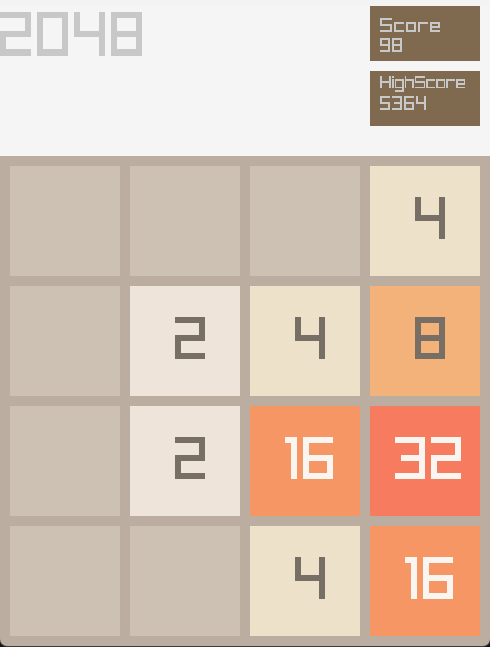
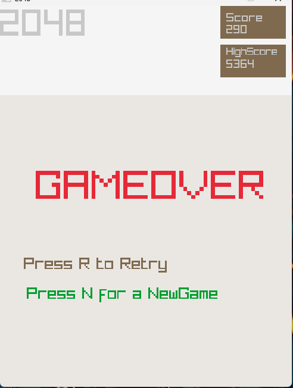

## currently unfinished

Questions you might ask:

"But Nati, you didn't use OOP, why not write the whole thing in C?"

Chillax, I'm working with what I know.

# Get Raylib

If you wish to use a specific version of raylib, follow the instructions below. If you want the current development version, skip this section and premake will download raylib for you.

## Download Raylib

Get the raylib sources from
https://github.com/raysan5/raylib
Download the zip file, or clone the repository. It doesn't matter what one you use.
Put the raylib sources in a folder called raylib inside your game folder (The same folder this file is in). The folder must be named raylib, it can not be raylib-master. The raylib folder should contain all the sources from raylib (including the 'src' folder)

## Using C++

By default this process is setup to build a project using C. If you want to use C++, you can replace your files with you own cpp files. There is is a simple C++ file in the \_app dir. The raylib template is designed for C, not C++, but the version in this repository has been modified to work as C++ if you choose to rename the files.

# Build your game

Only do ONE of these options depending on your compiler and platform.

## Windows Users

Double click the .sln file that was generated in the folder. From here you can use the project as normal.

## MinGW-w64 Users

Open your compiler terminal (w64devkit if you are using it), change to the game folder and type

    make

This will build your game

## Linux/macOS users

Open your terminal, change to the game folder and type.

    make

This will build your starting game template

# Building for other OpenGL targets

If you need to build for a different OpenGL version than the default (OpenGL 3.3) you can specify an openGL version in your premake command line. Just modify the bat file or add the following to your command line

## For OpenGL 1.1

--graphics=opengl11

## For OpenGL 2.1

--graphics=opengl21

## For OpenGL 4.3

--graphics=opengl43

# Building extra libs

If you need to add a separate library to your game you can do that very easily.
Simply copy the \_lib folder and rename it to what you want your lib to be called.
Replace lib.c with the sources for your library (just copy them in the folder).
If you library has an include folder, copy that too.
Then go to the premake5.lua file in the game folder, and link your library by calling link_to with the folder name for the library.

link_to("LIB_FOLDER_NAME")

Rerun premake and it will build your library for you.
Note that by default link_to will add include dirs for your library folder and library/include. If you have other include needs you will have to add those to your premake file manually.

